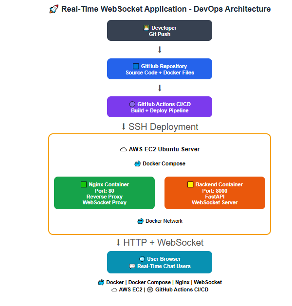

# Real-Time WebSocket Application Deployment

## Project Overview

This project demonstrates the deployment of a real-time WebSocket chat application using modern DevOps practices.

The application is deployed on AWS EC2 using Docker containers, Docker Compose, Nginx Reverse Proxy, and automated CI/CD deployment using GitHub Actions.

The main focus of this assignment:

- Containerization
- Docker networking
- Nginx reverse proxy configuration
- WebSocket communication
- Cloud deployment
- CI/CD automation

---

# Architecture Diagram



---

# Technology Stack

| Component | Technology |
|-----------|------------|
| Cloud Platform | AWS EC2 |
| Operating System | Ubuntu Linux |
| Containerization | Docker |
| Container Management | Docker Compose |
| Reverse Proxy | Nginx |
| Backend Framework | FastAPI |
| Communication | WebSocket |
| CI/CD | GitHub Actions |
| Workflow File | .github/workflows/deploy.yml |
| Version Control | GitHub |

---

# Repository Structure

```text
Deployment-of-Real-Time-WebSocket-Application
│
├── .github
│   └── workflows
│       └── deploy.yml              # GitHub Actions CI/CD pipeline
│
├── app
│   ├── main.py                     # FastAPI WebSocket application
│   └── requirements.txt             # Python dependencies
│
├── frontend
│   └── index.html                  # Chat application UI
│
├── Dockerfile                      # Backend container image
├── docker-compose.yml              # Multi-container configuration
├── nginx.conf                      # Nginx reverse proxy configuration
├── architecture-diagram.png        # Application architecture diagram
└── README.md
```

---

# Infrastructure Architecture

The application is deployed on an AWS EC2 Ubuntu server.

The overall architecture flow:

```text
User Browser
      |
      |
AWS EC2 Public IP
      |
      |
Nginx Container (Port 80)
      |
      |
Docker Internal Network
      |
      |
Backend WebSocket Container (Port 8000)
```

The user accesses the application through the EC2 public IP.

Nginx acts as the entry point and forwards WebSocket requests to the backend container through the Docker network.

---

# Docker Container Setup

The application runs using multiple Docker containers managed by Docker Compose.

Docker Compose is responsible for creating, configuring, and running the required services.

The Docker Compose file defines two services:

---

## Backend Service

Responsibilities:

- Runs FastAPI WebSocket application
- Handles real-time communication
- Provides backend API services
- Runs using Uvicorn server
- Exposes port 8000 internally

---

## Nginx Service

Responsibilities:

- Acts as reverse proxy
- Serves frontend static files
- Exposes application through port 80
- Routes requests to backend service
- Supports WebSocket upgrade requests

---

Containers are managed using:

```text
docker-compose.yml
```

Start application:

```bash
docker compose up -d --build
```

Check running containers:

```bash
docker ps
```

---

# Docker Networking

Docker Compose automatically creates an internal bridge network for the application.

Containers communicate using service names instead of container IP addresses.

Example:

```text
Nginx Container
       |
       |
       v
Backend Container
```

Nginx communicates with backend using:

```text
backend:8000
```

instead of:

```text
localhost:8000
```

Reason:

Every Docker container has its own network namespace.

Inside the Nginx container:

```text
localhost = Nginx container itself
```

Docker Compose provides built-in DNS resolution, allowing containers to communicate using service names.

Benefits:

- Container isolation
- Automatic service discovery
- Easy communication between services
- No dependency on changing container IP addresses

---

# Nginx Reverse Proxy

Nginx acts as the entry point for external traffic.

Request flow:

```text
Client Browser
       |
       |
       v
Nginx Reverse Proxy
       |
       |
       v
Backend Application
```

Advantages:

- Provides a single public endpoint
- Keeps backend container private
- Improves security
- Handles request routing
- Supports WebSocket proxying

---

# WebSocket Communication Through Nginx

WebSocket provides persistent communication between client and server.

The browser initially sends an HTTP request and upgrades the connection into a WebSocket connection.

Nginx is configured to forward WebSocket upgrade requests.

Configuration:

```nginx
proxy_http_version 1.1;

proxy_set_header Upgrade $http_upgrade;

proxy_set_header Connection "upgrade";
```

Flow:

```text
User Browser
      |
      |
WebSocket Connection
      |
      |
Nginx Proxy
      |
      |
Backend WebSocket Server
```

This allows multiple users to communicate in real time.

---

# CI/CD Pipeline

Deployment is automated using GitHub Actions.

Workflow file:

```text
.github/workflows/deploy.yml
```

Pipeline flow:

```text
Developer
    |
    |
git push
    |
    |
GitHub Repository
    |
    |
GitHub Actions
    |
    |
SSH into EC2
    |
    |
git pull latest code
    |
    |
docker compose down
    |
    |
docker compose up -d --build
```

Every code push automatically deploys the latest application version to EC2.

---

# Issues Found and Fixed

During debugging, four major configuration issues were identified and fixed.

---

## 1. Dockerfile Host Binding Issue

### Problem

Backend container was running with:

```dockerfile
uvicorn main:app --host 127.0.0.1
```

The application was only listening inside the container itself, so Nginx could not communicate with the backend.

### Fix

Changed to:

```dockerfile
uvicorn main:app --host 0.0.0.0
```

### Explanation

`127.0.0.1` listens only inside the container.

`0.0.0.0` listens on all network interfaces and allows other containers to access the application.

---

## 2. Docker Compose Frontend Volume Issue

### Problem

Frontend volume mount was commented:

```yaml
# - ./frontend:/usr/share/nginx/html:ro
```

Because of this, Nginx displayed the default welcome page instead of the application UI.

### Fix

Enabled:

```yaml
volumes:
  - ./frontend:/usr/share/nginx/html:ro
  - ./nginx.conf:/etc/nginx/nginx.conf:ro
```

### Explanation

Docker containers have isolated filesystems.

The volume mount shares frontend files with the Nginx container.

Flow:

```text
Host Machine

frontend/index.html

        |
        |

Nginx Container

/usr/share/nginx/html
```

---

## 3. Nginx Reverse Proxy Issue

### Problem

Nginx was forwarding requests to:

```nginx
proxy_pass http://localhost:8000/ws;
```

Inside the Nginx container, localhost refers to Nginx itself.

### Fix

Changed to:

```nginx
proxy_pass http://backend:8000/ws;
```

### Explanation

Docker Compose provides DNS resolution using service names.

Backend can be accessed using:

```text
backend:8000
```

---

## 4. Missing WebSocket Upgrade Headers

### Problem

Headers were disabled:

```nginx
# proxy_set_header Upgrade $http_upgrade;
# proxy_set_header Connection "upgrade";
```

### Fix

Enabled:

```nginx
proxy_set_header Upgrade $http_upgrade;

proxy_set_header Connection "upgrade";
```

### Explanation

WebSocket starts as an HTTP request and requires an upgrade handshake.

These headers convert the connection into a persistent WebSocket connection.

---

# Deployment Steps

## 1. Clone Repository

```bash
git clone https://github.com/amrutha777/Deployment-of-Real-Time-WebSocket-Application.git
```

## 2. Navigate to Project

```bash
cd Deployment-of-Real-Time-WebSocket-Application
```

## 3. Build and Start Containers

```bash
docker compose up -d --build
```

## 4. Verify Containers

```bash
docker ps
```

---

# Deployment Verification

After deployment, verify:

- Nginx container is running
- Backend container is running
- Port 80 is accessible
- WebSocket communication works between multiple browser clients

Expected containers:

```text
chat-nginx
chat-backend
```

Application should be accessible through:

```text
http://<EC2_PUBLIC_IP>
```

---

# Live Application

Application URL:

```text
http://16.112.235.15/
```

Repository:

```text
https://github.com/amrutha777/Deployment-of-Real-Time-WebSocket-Application
```

---

# Container Restart Policy

Containers are configured with restart policies to automatically recover after failures or EC2 server restart.

Example:

```yaml
restart: always
```

If the EC2 instance restarts, Docker automatically starts the application containers again.

---

# Future Improvements

Optional production enhancements:

- HTTPS using Let's Encrypt SSL
- Domain configuration
- Monitoring using Prometheus and Grafana
- Redis for WebSocket scaling
- Terraform Infrastructure as Code
- AWS Load Balancer
- Auto Scaling

---

# Conclusion

The real-time WebSocket application was successfully deployed using:

- Docker
- Docker Compose
- Nginx
- AWS EC2
- GitHub Actions CI/CD

The final setup provides:

- Containerized deployment
- Automated deployment pipeline
- Reverse proxy configuration
- Real-time WebSocket communication
- Cloud-based production-style deployment